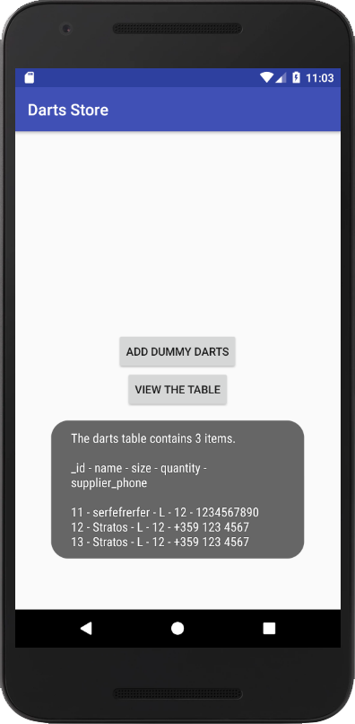

# Eighth Project - Inventory App, Stage 1

PROJECT SPECIFICATION
1. No UI is required for this project.

2. There exists a contract class that defines name of table and constants. Inside the contract class, there is an inner class for each table created. The contract contains at minimum constants for the Product Name, Price, Quantity, Supplier Name, and Supplier Phone Number.

3. There exists a subclass of SQLiteOpenHelper that overrides onCreate() and onUpgrade().

4. There is a single insert method that adds:
  - Product Name
  - Price
  - Quantity
  - Supplier Name
  - Supplier Phone Number
  
It is up to you to decide what datatype (e.g. INTEGER, STRING) each of these values should be; however, it is required that there are at least 2 different datatypes (e.g. INTEGER, STRING).

5. There is a single method that uses a Cursor from the database to perform a query on the table to retrieve at least one column of data. Also the method should close the Cursor after it's done reading from it.

6. Code is easily readable such that a fellow programmer can understand the purpose of the app.

7. All variables, methods, and resource IDs are descriptively named such that another developer reading the code can easily understand their function.

# Realisation: Darts Store App
Added two Buttons and a Toast to check if the datebase works well.

 
