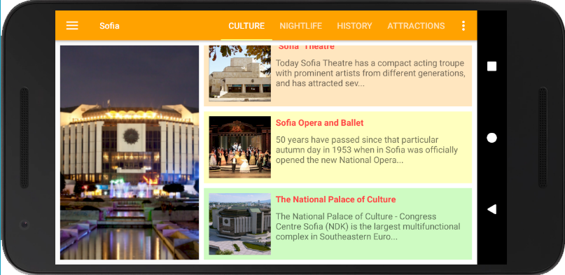

# Fifth Project - Multi-Screen App - Tour Guide App

PROJECT SPECIFICATION

1. App contains at least 4 lists of relevant attractions for a location
2. User navigates between lists in Fragments using either a Navigation Drawer or a ViewPager plus TabLayout.
3. Each list item contains information about an event, restaurant, historical site, or similar.
4. At least one list includes pictures of the location.
5. App contains a custom object for storing location information .
6. App uses a custom adapter to populate the layout with views based on instances of the custom class.
7. All strings are stored in the strings.xml resource file.
8. All images are stored as drawables. All drawables are stored at multiple densities.
9. Code is easily readable so that a fellow programmer can understand the purpose of the app.
10. All variables, methods, and resource IDs are descriptively named so that another developer reading the code can easily understand their function.

# Realisation - Bulgaria Tour Guide

Note: Works on all screen resolutions. Landscape and portrait mode.
This is not a commercial application. The video used in the application is owned by http://bulgariatravel.org/ and is here only for educational purposes!

     
     

