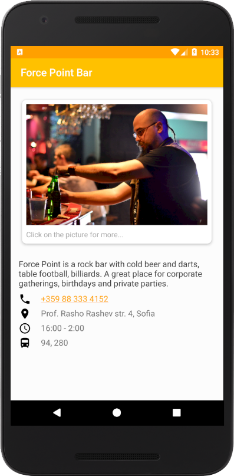
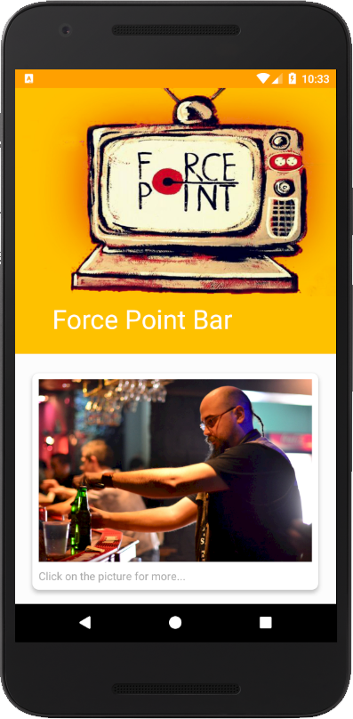
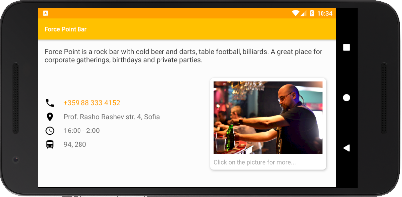

# First Project - Single Screen App

PROJECT SPECIFICATION

1. Your design must include:
     - Business name
     - At least one photo representing the business
     - Two or more other pieces of information, such as:
          - Contact information for the business (eg phone number, email address, website)
          - Address of the Business
          - Description of business
          - Hours of operation

2. Program must function in Android Studio emulator and on a phone. Upon launching on a phone, the card appears.

3. Layout scales responsively for screen sizes in portrait mode, with no part of any images only partially visible. Student is not responsible for responsive design in landscape mode.

Note: Reviewers will test on a Nexus 5X which has a screen size of 5.2 inches (132.08mm). It is advised you test on this size at minimum. If your content does not fit on this size, consider implementing a ScrollView.

4. XML must include a Relative Layout and/or a Linear Layout

5. Must have one or more image views or text views.

6. Elements are specified in dp, text is specified in sp.

# Realisation - Force Point Bar Business Card App

     
 

