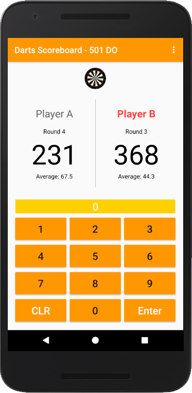

# Second Project - Score Keeper

PROJECT SPECIFICATION
1. The chosen game has either multiple amounts of points that can be scored, as in american football, or multiple important metrics to track, such as fouls, outs, and innings in baseball.

2. App is divided into two columns, one for each team.

3. Each column contains a large TextView to keep track of the current score for that team.
Optionally, a second TextView to track another important metric such as fouls can be added.

4. Each column contains multiple buttons. The buttons must track either:

Each track a different kind of scoring
Or
Each track a different metric (one score, the other fouls, for instance).

5. The layout contains a ‘reset’ button.

6. "The code adheres to all of the following best practices:

Text sizes are defined in sp
Lengths are defined in dp
Padding and margin is used appropriately, such that the views are not crammed up against each other."

7. Each score button updates the score TextView in its column by adding the correct number of points.

8. The reset button resets the scores on both of the score TextViews.

# Realisation - Darts Scoreboard

Note: Works on all screen resolutions. Landscape and portrait mode.

      
  
