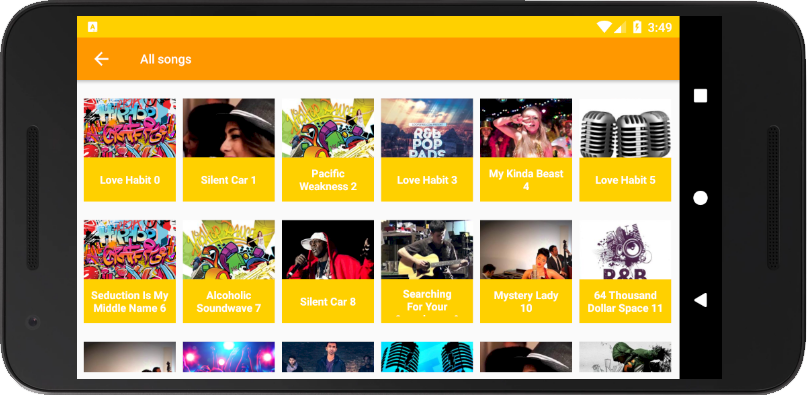

# Fourth Project - Musical Structure App

PROJECT SPECIFICATION
1. The app’s structure is suitable for a music player app. A similarly structured app which focuses on audiobooks, podcasts, or other audio media is also acceptable.
2. The purpose of each activity is easy for a user to understand through the UI design and feature labeling.
3. The app contains 2 to 6 activities
4. The app contains multiple activities, each labelled, which together make a cohesive music app.
5. Features in the app are clearly defined either by labelling or images. For example, a button to play music could use a universally recognized triangular "Play" symbol or could have the text label "Play".
6. Each activity contains button(s) which link it to other activities a user should be able to reach from that activity. For instance, a ‘Library’ activity might contain a button to move to the ‘Now Playing’ activity.
7. The code adheres to all of the following best practices:
- Text sizes are defined in sp
- Lengths are defined in dp
- Padding and margin is used appropriately, such that the views are not crammed up against each other.
8. Each button’s behavior is determined by an OnClickListener in the Java code rather than by the android:onClick attribute in the XML Layout.
9. Each button properly opens the intended activity using an explicit Intent.
10. App uses a custom adapter to populate the layout with views based on instances of the custom class.
11. Information about instances of the custom class are stored in an appropriate data structure (e.g. ArrayList, Array). When the information needs to be displayed, it is efficiently retrieved (e.g. Looping).
12. Data about each song (or equivalent audio media such as podcast episode) should be stored in a custom class that contains at least 2 states (e.g. Song Name, Artist Name) If images are included (e.g. Album Art), they are stored as drawables. All drawables are stored at multiple densities. Images are not required.

# Realisation - JukeBox Player

Note: Works on all screen resolutions. Landscape and portrait mode.

          
  
