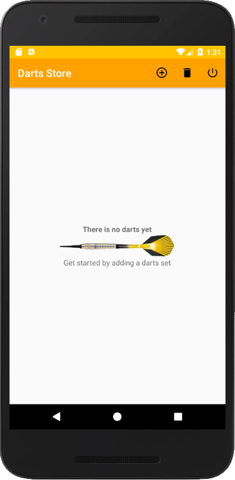
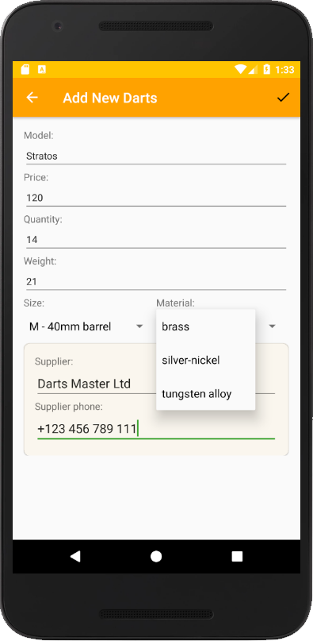
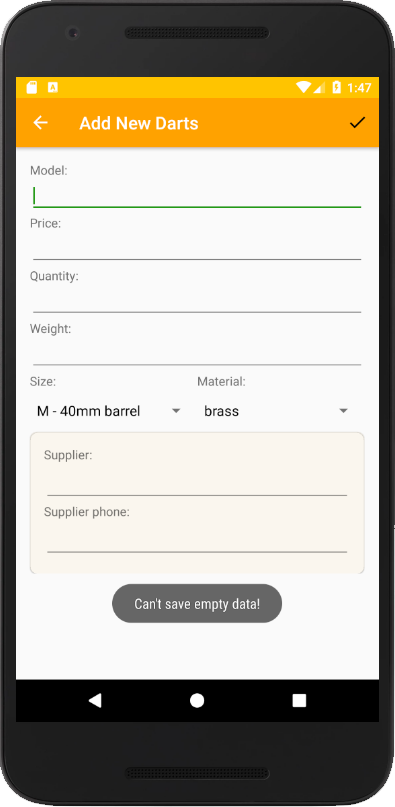
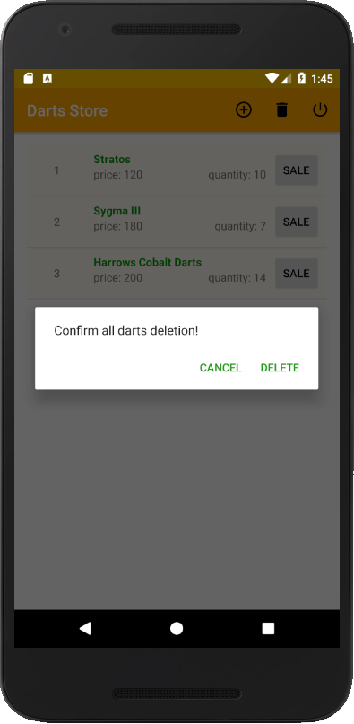
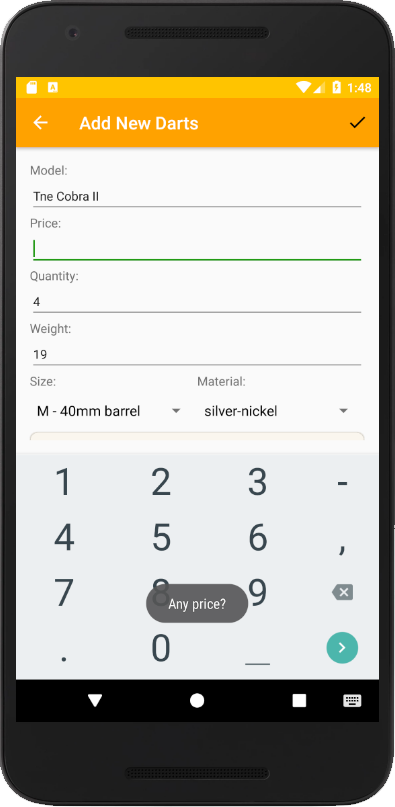
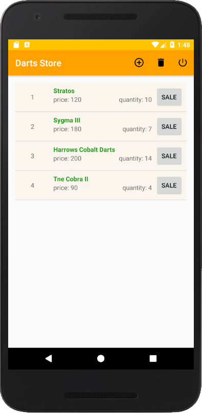
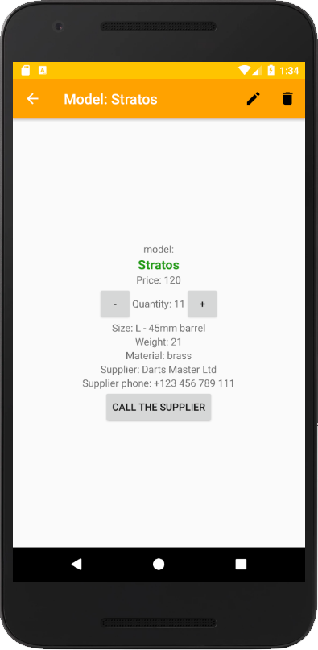
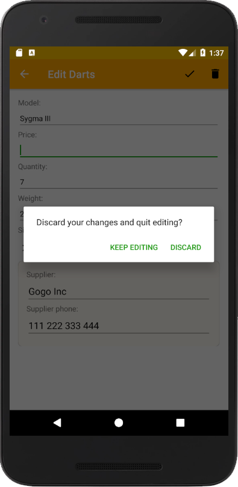
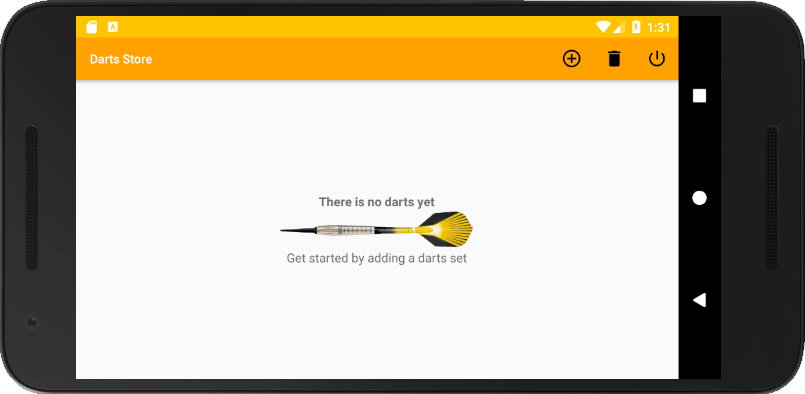
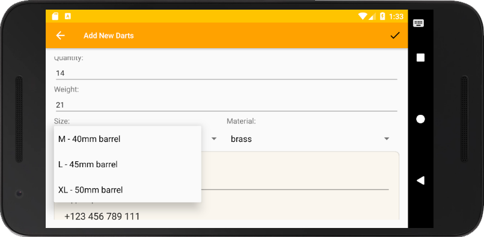

# Ninth Project - Inventory App, Stage 2

PROJECT SPECIFICATION
1. The app contains activities and/or fragments for the user to:
- Add Inventory
- See Product Details
- Edit Product Details
- See a list of all inventory from a Main Activity

Multiple actions listed above can be combined in a single activity.
The user navigates between the activities and/or fragments using one or more of the following navigation patterns - Navigation Drawer, View Pager, Up/Back Navigation, or Intents.

2. In the Main Activity/Fragment, each list item displays the Product Name, Price, and Quantity. 
Each list item also contains a SaleButton that reduces the total quantity of that particular product by one (include logic so that no negative quantities are displayed).

3. The Product Detail Layout displays the Product Name, Price, Quantity, Supplier Name, and Supplier Phone Number that's stored in the database.
 The Product Detail Layout also contains buttons that increase and decrease the available quantity displayed. 
 Add a check in the code to ensure that no negative quantities display (zero is the lowest amount). 
 The Product Detail Layout contains a button to delete the product record entirely. 
 The Product Detail Layout contains a button to order from the supplier. 
 In other words, there exists a button to contains a button for the user to contact the supplier via an intent to a phone app using the Supplier Phone Number stored in the database.

4. When there is no information to display in the database, the layout displays a TextView with instructions on how to populate the database (e.g. what should be entered in the field, which fields are required).

5. The code runs without errors. 
For example, when user inputs product information (quantity, price, name), instead of erroring out, the app includes logic to validate that no null values are accepted. 
If a null value is inputted, add a Toast that prompts the user to input the correct information before they can continue.

6. The Main Activity displaying the list of current inventory contains a ListView that populates with the current products stored in the table.

7. The Main Activity contains an Add Product Button prompts the user for product information and supplier information which are then properly stored in the table. 
Before the information is added to the table, it must be validated -
In particular, empty product information is not accepted. 
If user inputs invalid product information (name, price, quantity, supplier name, supplier phone number), instead of erroring out, the app includes logic to validate that no null values are accepted. 
If a null value is inputted, add a Toast that prompts the user to input the correct information before they can continue.

8. In the Edit Product Activity, user input is validated. In particular, empty product information is not accepted. 
If user inputs invalid product information (name, price, quantity, supplier name, supplier phone number), instead of erroring out, the app includes logic to validate that no null values are accepted. 
If a null value is inputted, add a Toast that prompts the user to input the correct information before they can continue.

9. In the Main Activity that displays a list of all available inventory, each List Item contains a Sale Button which reduces the available quantity for that particular product by one (include logic so that no negative quantities are displayed).

10. When a user clicks on a List Item from the Main Activity, it opens up the detail screen for the correct product.

11. In the Detail View for each item, there are Buttons that correctly increase or decrease the quantity for the correct product. 
Add a check in the code to ensure that no negative quantities display (zero is the lowest amount). 
The student may also add input for how much to increase or decrease the quantity by if not using the default of 1. 

12. The Detail Layout contains a button for the user to contact the supplier via an intent to a phone app using the Supplier Phone Number stored in the database.

13. In the Detail Layout, there is a Delete Button that prompts the user for confirmation and, if confirmed, deletes the product record entirely and sends the user back to the main activity.

14. The intent of this project is to give you practice writing raw Java code using the necessary classes provided by the Android framework; therefore, the use of external libraries for core functionality will not be permitted to complete this project. 
(i.e. Database and content provider libraries are not allowed for this project. Butterknife and similar libraries for ease of coding are allowed)

# Realisation: Darts Store App

          
