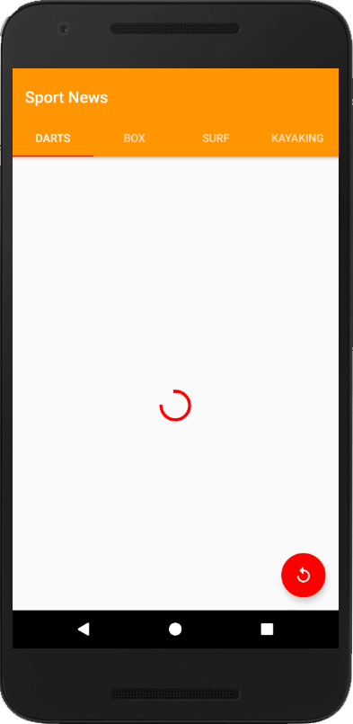
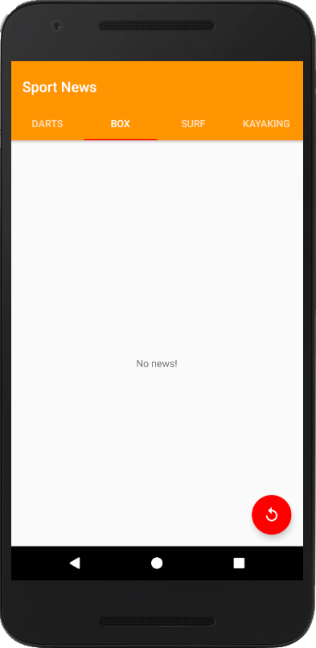
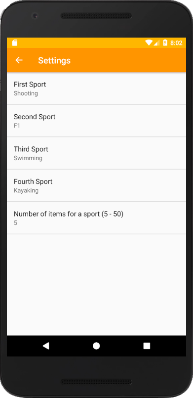
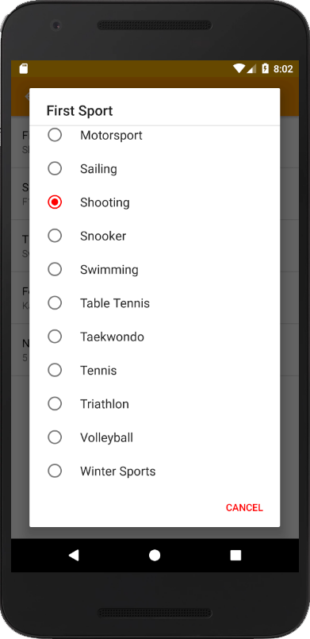
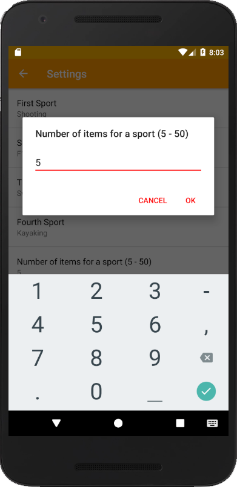

# Sixth Project - News App, Stage 2

PROJECT SPECIFICATION
1. Settings Activity allows users to see the value of all the preferences right below the preference name, and when the value is changed, the summary updates immediate.

2. App contains a main screen which displays multiple news stories

3. The title of the article and the name of the section that it belongs to are required field. 
If available, author name and date published should be included. Please note not all responses will contain these pieces of data, but it is required to include them if they are present. Images are not required.

4. Settings Activity is accessed from the Main Activity via a Navigation Drawer or from the toolbar menu. In accordance with Material Design Guidelines, it should be reached via the "Settings" label. Do not use synonyms such as "Options" or "Preferences."

5. App queries the content.guardianapis.com API to fetch news stories related to the topic chosen by the user, using either the ‘test’ api key or the student’s key. The query is narrowed down by the preferences selected by the user in the Settings.

6. Networking operations are done using a Loader rather than an AsyncTask.

7. The intent of this project is to give you practice writing raw Java code using the necessary classes provided by the Android framework; therefore, the use of external libraries for the core functionality will not be permitted to complete this project.

8. Code is easily readable such that a fellow programmer can understand the purpose of the app.

9. All variables, methods, and resource IDs are descriptively named such that another developer reading the code can easily understand their function.

10. The code is properly formatted i.e. there are no unnecessary blank lines; there are no unused variables or methods; there is no commented out code. The code also has proper indentation when defining variables and methods.

11. All Strings are stored in the strings.xml resource file.

# Realisation: Sport News App with Settings

                     
  
