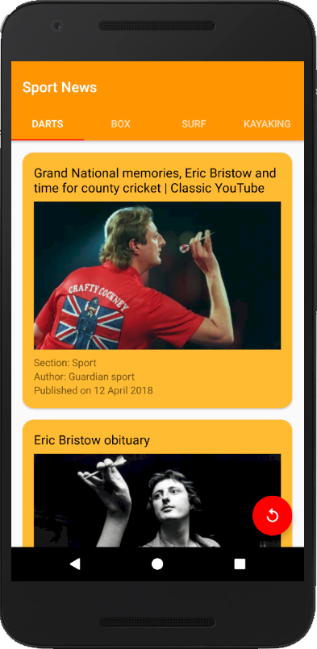
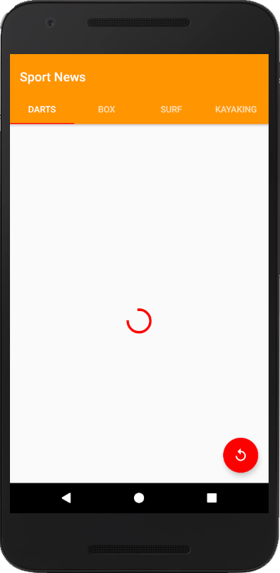
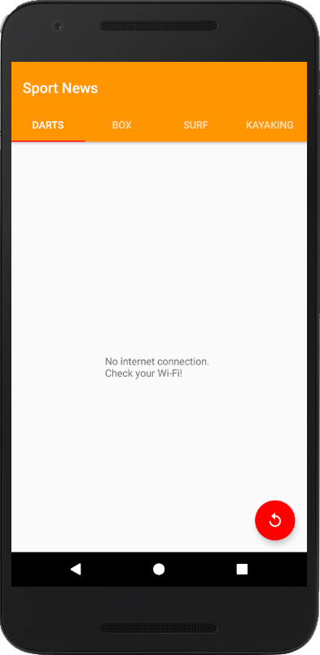
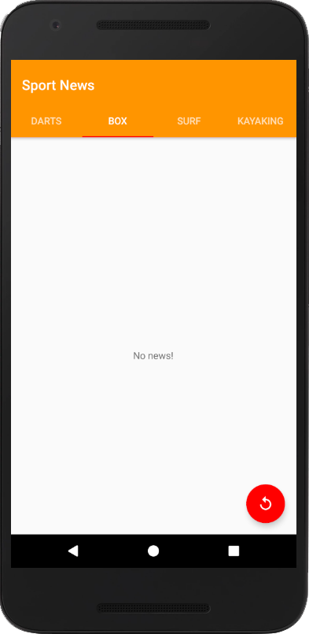
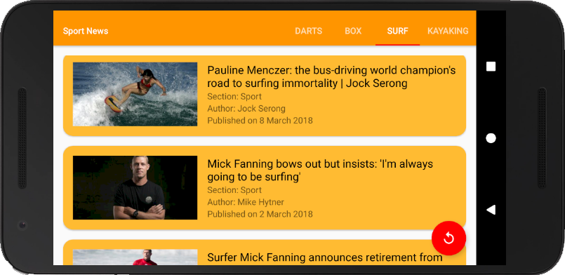
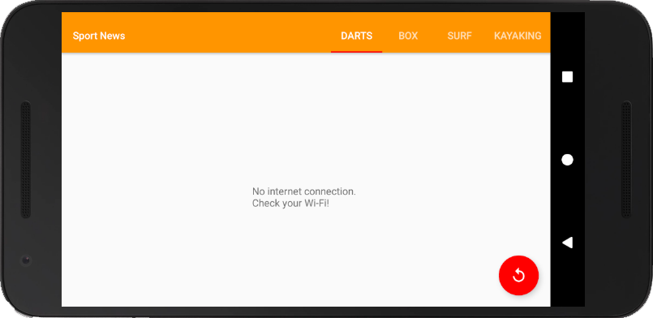

# Sixth Project - News App, Stage 1

PROJECT SPECIFICATION
1. App contains 4 - 10 questions, including at least one check box, one radio button, and one text entry.

2. Questions are in a variety of formats such as free text response, checkboxes, and radio buttons. Checkboxes are only used for questions with multiple right answers. Radio buttons are only used for questions with a single right answer.

3. App includes a button for the user to submit their answers and receive a score.

4. The code adheres to all of the following best practices:

  - Text sizes are defined in sp
  - Lengths are defined in dp
  - Padding and margin is used appropriately, such that the views are not crammed up against each other.

5. The app includes at least four of the following Views: TextView, ImageView, Button, Checkbox, EditText, LinearLayout, RelativeLayout, ScrollView, RadioButton, RadioGroup. If applicable, the app uses nested ViewGroups to reduce the complexity of the layout.

6. The app gracefully handles displaying all the content on screen when rotated. Either by updating the layout, adding a scrollable feature or some other mechanism that adheres to Android development guidelines.

7. Each question has a correct answer.

8. Any question which uses radio buttons allows only one to be checked at once.

9. The app contains at least one if/else statement.

10. The grading button displays a toast which accurately displays the results of the quiz.

11. The grading logic checks each answer correctly. The app accurately calculates the number of correct answers and does not include incorrect answers in the count.

This project is about combining various ideas and skills we’ve been practicing throughout the course. They include:
  Connecting to an API
  Parsing the JSON response
  Handling error cases gracefully
  Updating information regularly
  Using an AsyncTask
  Doing network operations independent of the Activity lifecycle

# Realisation:

            
  
