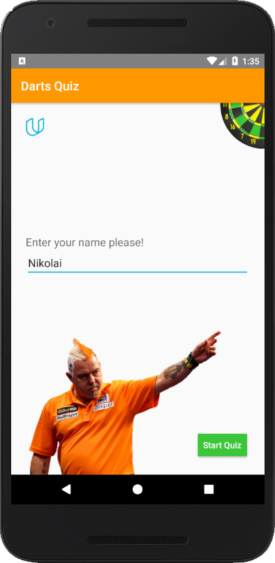
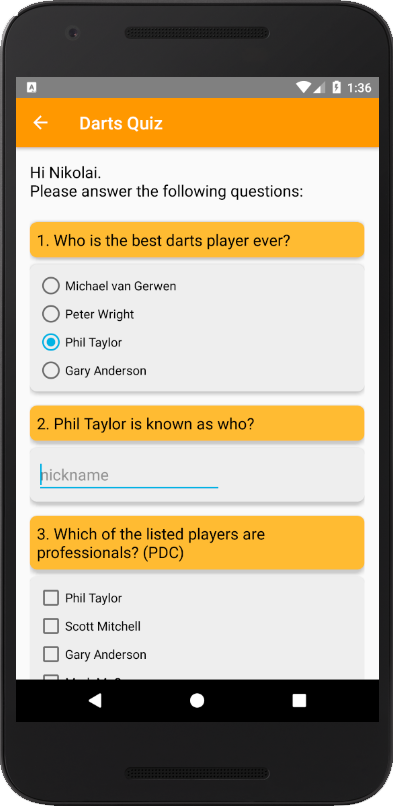
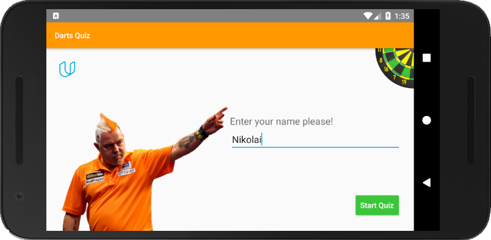

# Second Project - Quiz App

PROJECT SPECIFICATION
1. App contains 4 - 10 questions, including at least one check box, one radio button, and one text entry.

2. Questions are in a variety of formats such as free text response, checkboxes, and radio buttons. Checkboxes are only used for questions with multiple right answers. Radio buttons are only used for questions with a single right answer.

3. App includes a button for the user to submit their answers and receive a score.

4. The code adheres to all of the following best practices:

  - Text sizes are defined in sp
  - Lengths are defined in dp
  - Padding and margin is used appropriately, such that the views are not crammed up against each other.

5. The layout contains a ‘reset’ button.

6. "The code adheres to all of the following best practices:

Text sizes are defined in sp
Lengths are defined in dp
Padding and margin is used appropriately, such that the views are not crammed up against each other."

7. Each score button updates the score TextView in its column by adding the correct number of points.

8. The reset button resets the scores on both of the score TextViews.

# Realisation - Darts Quiz

      
  
